# 🏋️‍♂️ Gym Management System - JAVA

A GUI-based Gym Management System built using Java Swing for my university course.

This project was developed using both **Apache NetBeans** (for GUI design and layout) and **IntelliJ IDEA** (for enhanced code editing and management). The system manages gym members, bookings, trainers, and feedback, storing all data in flat `.txt` files. The interface is fully styled using custom image assets, NetBeans layout tools, and form-based components.

## Created by
- **Umer**
- **Mashood**


Course: *Object Oriented Programming (OOP)*

---

## Features

- Member registration and login
- Role-based dashboards (Admin / Member)
- Session bookings with trainer selection
- Gym store with visual product grid
- Password change functionality
- User feedback collection
- Admin controls: set membership, remove users, update reports

---

## Technologies Used

- **Java (JDK 8+)**
- **Swing GUI** with NetBeans `.form` builder
- **Apache NetBeans** (for layout and build)
- **IntelliJ IDEA** (for code enhancements)
- **VS Code** (for final cleanup)
- No external libraries — fully native Java project

---
## Project Structure

```plaintext

nbproject/             → NetBeans-specific project configuration files
src/main/              → All .java and .form files (main source code and GUI layout)
(.form files)          → GUI layout designed in NetBeans Swing builder
src/main/assets/       → All image resources used in the GUI (icons, backgrounds, products)
members.txt            → Stores gym member registration data
bookings.txt           → Stores user session/trainer bookings
feedback.txt           → Stores feedback submitted by members
build.xml              → Apache Ant build script (for NetBeans)
README.md              → This file
.gitignore             → Git exclusion rules (main branch only)

```

---

## How to Run

### ✅ In NetBeans
1. Open the project folder in NetBeans.
2. Clean and Build the project using `Shift + F11`. (Ant will handle the build via `build.xml`).
3. Run the project from the main class: `oopproject.java`.

### ✅ In VS Code / Terminal

javac src/main/*.java

java -cp src/main oopproject

---

## Branches

- `main` – Clean version for public viewing. Excludes build files, IDE-specific settings, and compiled classes using `.gitignore`.

- `backup` – Full working backup of the entire project. Includes NetBeans `build/`, `dist/`, private settings, and `.class` files for immediate use without setup.

---

## What I Learned

This project helped me gain practical experience in:

- Structuring Java projects using Object-Oriented Programming principles
- Designing responsive GUI applications using Swing and NetBeans Form Builder
- Managing file-based data persistence with `.txt` files
- Organizing large codebases and working with NetBeans and IntelliJ
- Cleaning up and preparing a project for GitHub using branches, `.gitignore`, and documentation
- Understanding the importance of separating clean/public branches from full backup branches for real-world version control

---

## Future Improvements

While the current version is fully functional, there are many ways to expand or enhance the project:

- Replace `.txt` storage with a proper database (e.g., MySQL, SQLite)
- Add encryption for password storage and user data
- Improve GUI responsiveness and layout with JavaFX or web-based frontend (HTML/CSS/JavaScript)
- Implement session timeout and more secure login validation
- Add charts or analytics for admin (e.g., feedback trends, user activity)
- Export data to PDF or CSV for admin reporting
- Improve code modularity by refactoring repeated logic into reusable utility classes


## 🖼️ GUI Previews

> These are some of the screenshots from the custom Java Swing interface designed in Apache NetBeans.

---

### 🔐 Login Page  
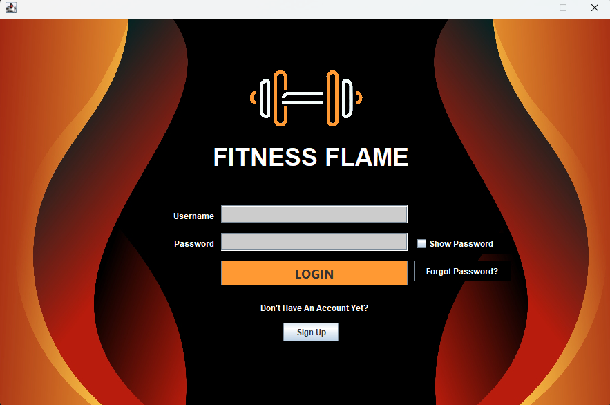

### 🆕 Sign-Up Page  
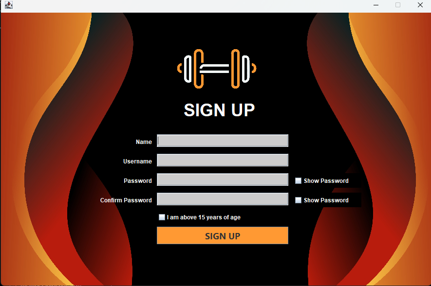

### 👤 Member Menu  
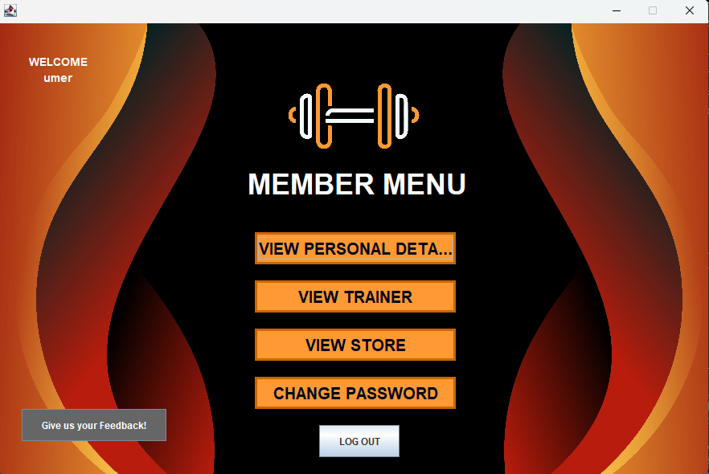

### 🧭 Choose Membership (Member Side)  
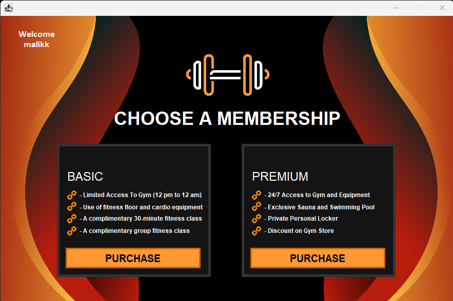

### 💳 Card Details  
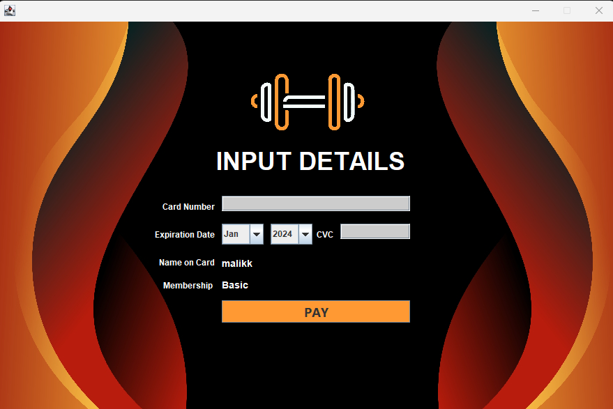

### 🔄 Change Password  
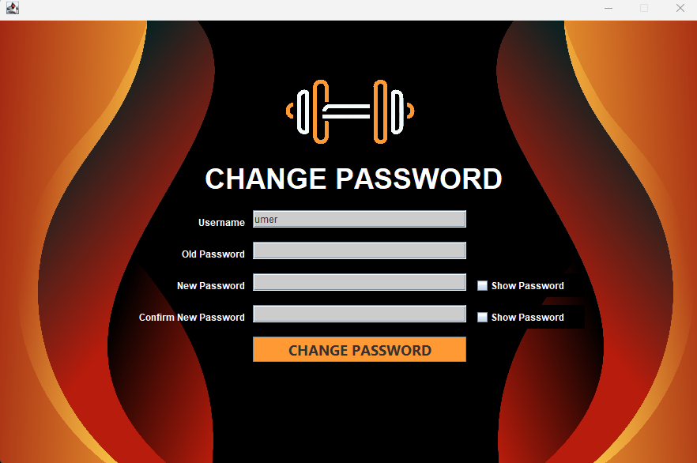

### ❓ Forgot Password  
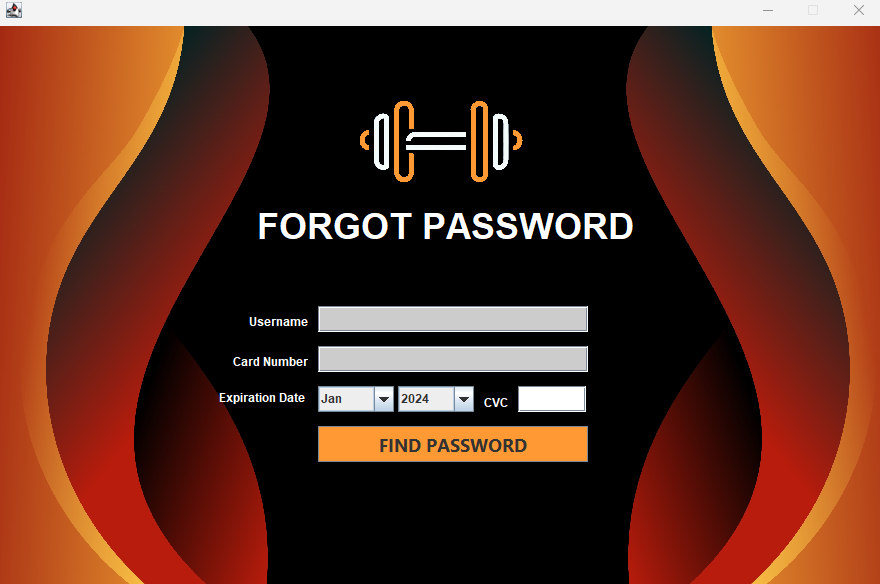

### 🧾 Feedback Form  
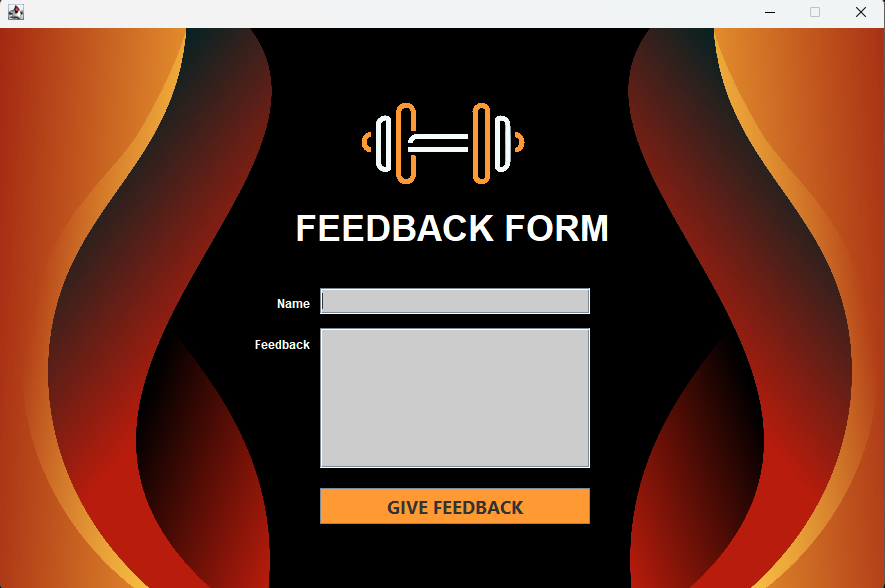

---

## ⚙️ Admin Panel Screens


### 🛠️ Admin Menu  
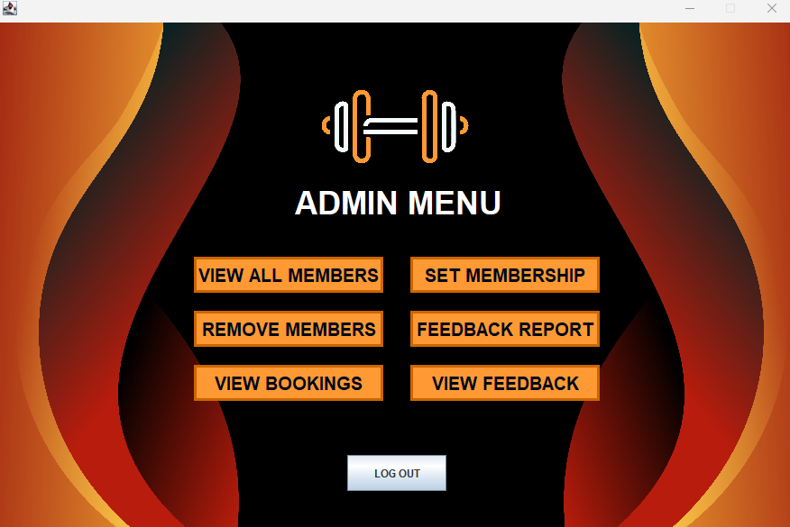

### 📋 Set Membership  
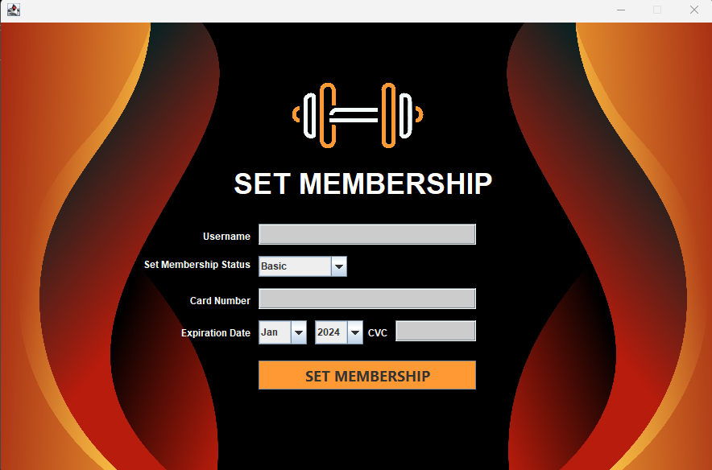

### 🗑️ Remove Member  
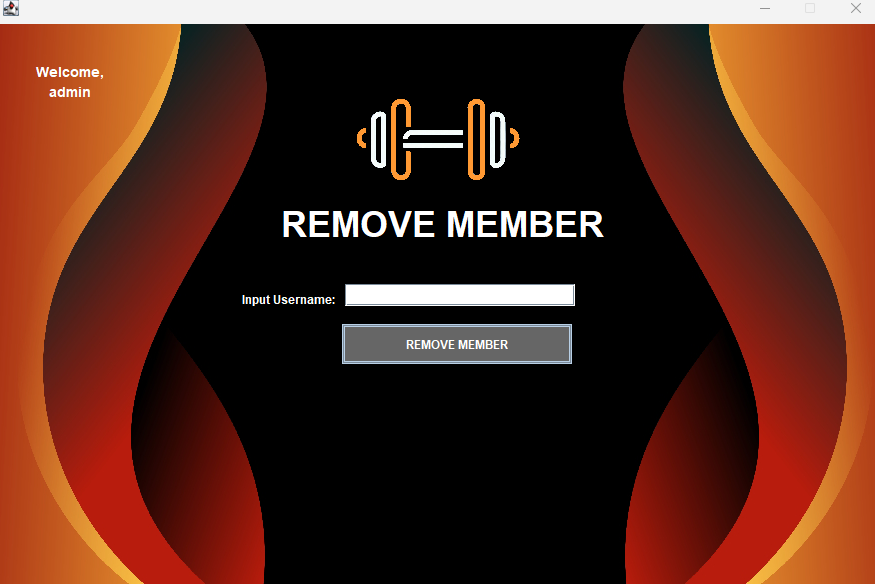

### 📄 Change Report Status  
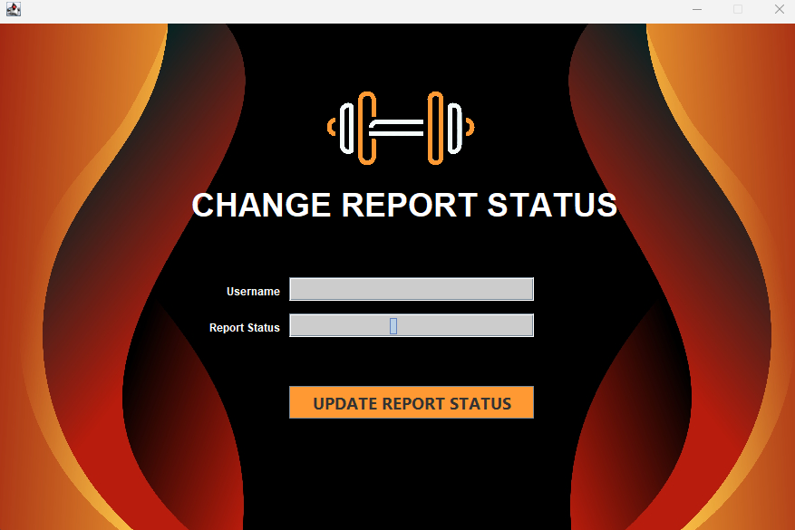
